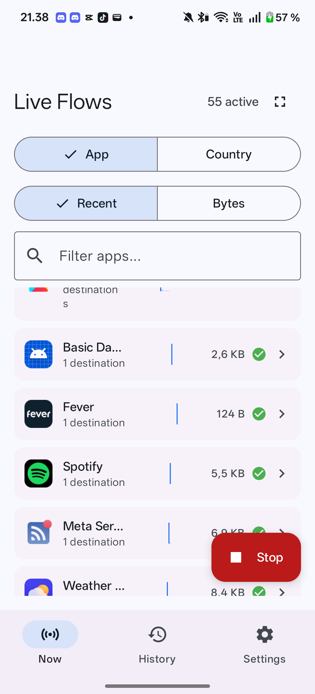
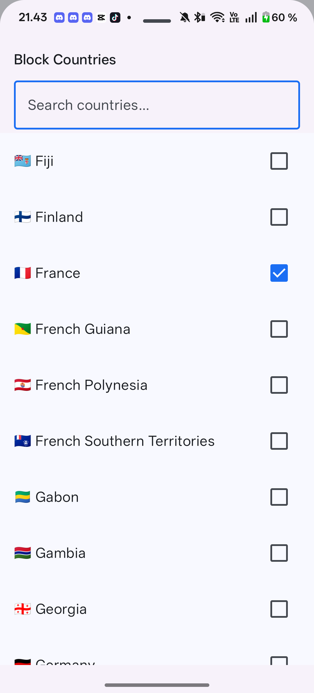
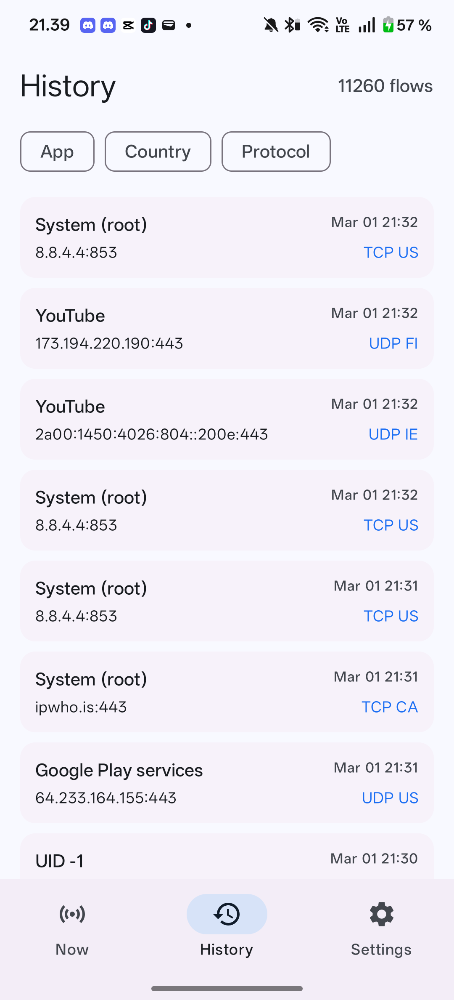
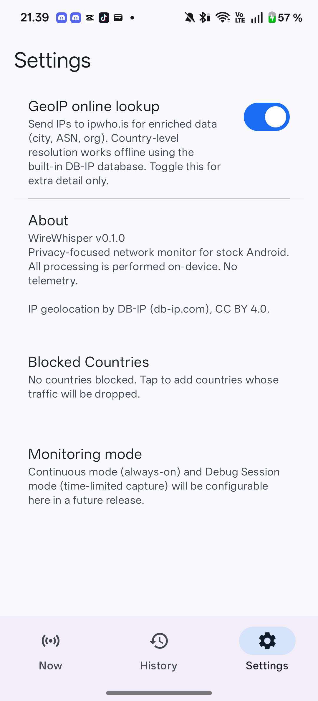

<p align="center">
  
</p>

# WireWhisper

A privacy-focused network monitor for stock Android. No root required.

WireWhisper uses Android's VpnService API to capture all device traffic, showing you exactly which apps are connecting where — with app attribution, DNS/TLS hostname resolution, country-level geolocation, and per-app/hostname/country blocking. All processing happens on-device. No telemetry.

<p align="center">
  
  
  
  
</p>

## Features

**Live Monitoring**
- Real-time flow list grouped by app or destination country
- App icons, DNS hostnames, TLS SNI names, traffic sparklines
- Tap sparklines for a 60-second bidirectional traffic chart
- Sort by recent activity or total bytes
- Search/filter by app name, package, or hostname
- Fullscreen mode

**Firewall**
- Block entire apps, individual hostnames, or whole countries
- Proactive country blocking from Settings — block before traffic is observed
- Visual feedback: blocked icons shake on each dropped packet
- Rules persisted to local database, loaded at startup

**Geolocation**
- Offline country resolution via bundled DB-IP database (no network calls)
- Optional online lookup (ipwho.is) for city, ASN, and org enrichment
- Auto-refreshed monthly via WorkManager

**History**
- Persisted flow history with filter chips (app, country, protocol)
- Detailed per-flow view: app identity, connection info, traffic stats, timeline

## Usage

### Getting Started

1. Install the APK (or build from source)
2. Tap the play button on the Now screen
3. Accept the Android VPN permission prompt — WireWhisper creates a local VPN to observe traffic (nothing leaves your device)

### Monitoring

- **App view** — flows grouped by app, with icons, hostnames, and traffic sparklines
- **Country view** — flows grouped by destination country with flag indicators
- Tap a row to expand and see individual connections
- Tap a sparkline to open a 60-second bidirectional traffic chart
- Use the search bar to filter by app name, package, or hostname
- Sort by most recent activity or total bytes transferred

### Blocking

- Tap the shield icon next to any app, hostname, or country to block it
- Blocked entries show a shaking icon animation on each dropped packet
- Block entire countries proactively from Settings before any traffic is observed
- Rules persist across restarts

### History & Detail

- Switch to the History tab to browse past connections
- Use filter chips to narrow by app, country, or protocol
- Tap any flow for a detailed view: app identity, connection info, traffic stats, and timeline

### Settings

- **GeoIP online lookup** — off by default; enable for enriched data (city, ASN, org) via ipwho.is
- **Blocked Countries** — proactively block countries from the full country list
- Country-level geolocation works offline using the bundled DB-IP database

## Requirements

- Android 16+ (SDK 36)
- No root access needed

## Build

```bash
# Debug APK
./gradlew assembleDebug

# Release APK (requires signing env vars)
./gradlew assembleRelease

# Unit tests
./gradlew testDebugUnitTest

# Download GeoIP database (auto-runs on preBuild if missing)
./gradlew downloadGeoDb
```

Release signing requires these environment variables: `KEYSTORE_BASE64`, `KEY_ALIAS`, `KEY_PASSWORD`, `KEYSTORE_PASSWORD`.

## Architecture

Single-module Kotlin app with package-based modularity. Manual DI via `WireWhisperApp` (no Hilt).

```
App traffic -> TUN fd -> TunProcessor.readLoop()
  -> PacketParser.parse() -> PacketInfo
  -> FlowTracker.onPacket() (ConcurrentHashMap, 500ms debounced StateFlow)
  -> UidResolver (ConnectivityManager primary, /proc/net fallback)
  -> HostnameResolver (DNS response + TLS SNI extraction)
  -> GeoResolver (LRU cache -> offline binary DB -> Room cache -> optional online API)
  -> BlockingEngine.isBlocked() (O(1) concurrent set lookups)
  -> UDP relay (DatagramChannel + Selector) or TCP relay (SocketChannel proxy)
```

| Package | Purpose |
|---------|---------|
| `vpn/` | VPN lifecycle, TUN read loop, UDP/TCP relay |
| `packet/` | Zero-copy IPv4/IPv6, TCP, UDP parsers; DNS and TLS SNI extraction |
| `flow/` | Flow aggregation, traffic sampling (ring buffer), UID and hostname resolution |
| `geo/` | Offline binary GEO1 format lookup, Room cache, optional online enrichment |
| `firewall/` | In-memory blocking sets backed by Room (app, hostname, country) |
| `data/` | Room database (v4), entities, DAOs, repository pattern |
| `ui/` | Jetpack Compose + Material 3; screens: Now, History, Detail, Settings |

## Tech Stack

| Component | Version |
|-----------|---------|
| AGP | 9.0.1 |
| Kotlin | 2.0.21 |
| Compose BOM | 2025.05.00 |
| Room | 2.7.1 |
| Navigation Compose | 2.9.0 |
| Min/Target SDK | 36 |
| Java | 17 |

## Permissions

| Permission | Purpose |
|------------|---------|
| `INTERNET` | Relay sockets for proxied traffic |
| `FOREGROUND_SERVICE` | Keep VPN running in background |
| `FOREGROUND_SERVICE_SPECIAL_USE` | VPN monitoring (API 34+) |
| `POST_NOTIFICATIONS` | Foreground service notification (API 33+) |
| `QUERY_ALL_PACKAGES` | Resolve UID to app name |

## CI/CD

GitHub Actions builds on every push to `master` and on tags matching `v*`. Tagged pushes create a GitHub Release with the signed APK attached.

## Known Limitations

- **Single VPN** — conflicts with commercial VPNs or work profile VPNs
- **Battery attribution** — Android may attribute all network battery usage to WireWhisper
- **DNS-over-HTTPS/TLS** — apps using private DNS bypass hostname interception (IP flows still visible)
- **VPN icon** — system shows a persistent key icon in the status bar

## Credits

IP geolocation by [DB-IP](https://db-ip.com), licensed under [CC BY 4.0](https://creativecommons.org/licenses/by/4.0/).
